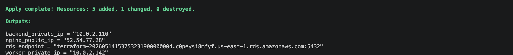
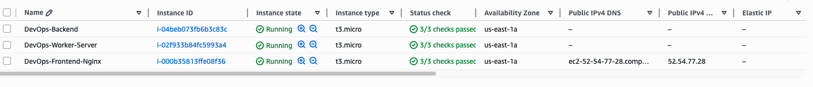
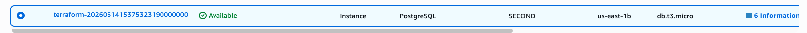
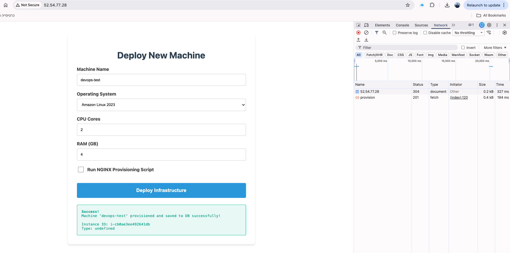
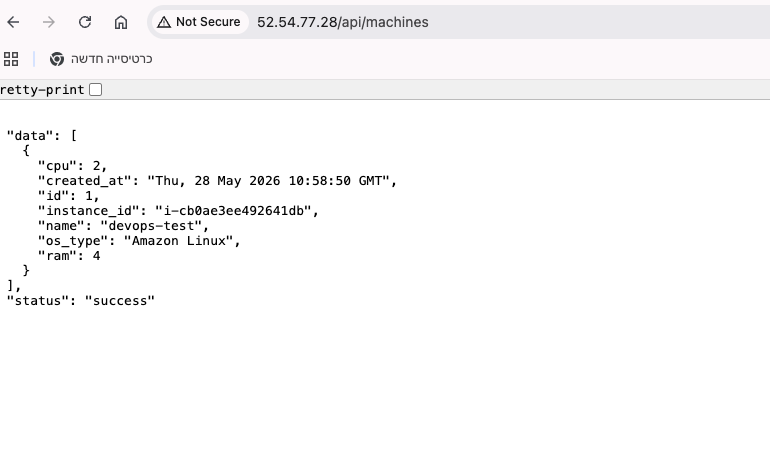
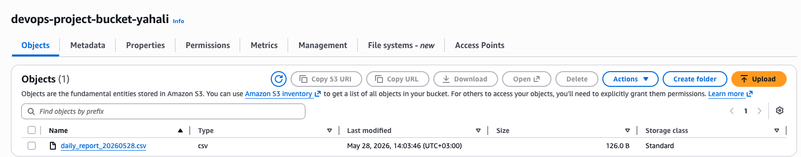
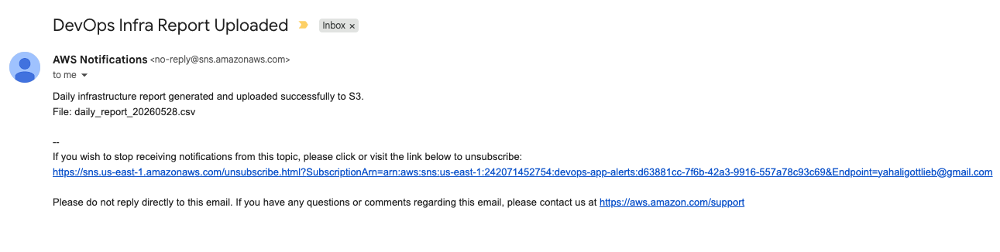

# DevOps on AWS - Project 2: Infrastructure as Code & Configuration Management

**Author:** Yahali

## Project Overview
This project automates the provisioning and configuration of a 3-tier web application environment on AWS. We transitioned from a manual AWS Console setup to a fully automated Infrastructure as Code (IaC) approach using **Terraform** for infrastructure and **Ansible** for configuration management.

## Architecture
The environment is structured securely with a separation of concerns:
* **VPC:** Custom Virtual Private Cloud (10.0.0.0/16).
* **Public Subnet:** Hosts the Frontend/Nginx server and a NAT Gateway.
* **Private Subnets:** Host the Backend server, Worker server, and RDS PostgreSQL instance.
* **Internet & Routing:** Internet Gateway for public access, and a NAT Gateway to allow private instances to download updates securely.


## Components Created by Terraform
* **Networking:** VPC, Public & Private Subnets, Internet Gateway, NAT Gateway, Route Tables.
* **Security:** Strict Security Groups for Frontend (HTTP/HTTPS/SSH), Backend (Internal VPC traffic only), and RDS (PostgreSQL port 5432 accessible only from specific Security Groups).
* **Compute:** 3 EC2 Instances (`t3.micro`) tagged appropriately: Frontend, Backend, and Worker.
* **Database:** AWS RDS PostgreSQL multi-AZ subnet group setup.
* **Storage & Messaging:** S3 Bucket for files and SNS Topic with Email Subscription for alerts.

### Terraform Variables
* `aws_region`: The deployment region (default: `us-east-1`).
* `instance_type`: EC2 size (default: `t3.micro`).
* `ami_id`: Base image for the servers (Ubuntu 22.04 LTS).
* `key_name`: Name of the AWS Key Pair for SSH access.

### Terraform State Management
For this project, the `terraform.tfstate` is managed locally in the project directory. This is sufficient for an individual assignment. In a production environment with multiple team members, the state should be migrated to a remote backend (such as an AWS S3 Bucket with DynamoDB for state locking) to prevent conflicts and ensure security.

## Actions Performed by Ansible
* **Base Setup:** Updates APT cache and installs common packages (`python3`, `pip`, `libpq-dev`, `curl`, `git`) on all servers.
* **Frontend:** Installs Nginx, copies the `index.html` file, and configures Nginx as a web server and Reverse Proxy using a `.j2` template.
* **Backend & Worker:** Creates a dedicated application directory, copies source code (`app.py`, `src/`, `configs/`), creates a Python Virtual Environment, and installs `requirements.txt` dependencies.
* **Service Management:** Generates and enables a `systemd` service (`app.service`) to run the Python application continuously in the background.

### Ansible Variables
* `rds_endpoint`: Passed as an extra variable (`-e`) during execution to dynamically provide the Python application with the database connection string.

## Secrets Management
* **SSH Keys:** The private key (`.pem` file) is kept locally on the control machine with strict `400` permissions. It is never uploaded to the repository.
* **Database Credentials (Bonus Feature):** To avoid hard-coding sensitive information, the RDS PostgreSQL password is encrypted using **Ansible Vault** in a `secrets.yml` file. When running the Ansible playbook, the `--ask-vault-pass` flag must be used to decrypt and inject the password securely into the application environment.

## Instructions: How to Run the Project

### 1. Provision Infrastructure (Terraform)
Navigate to the `terraform` directory and run:
```bash
terraform init
terraform plan
terraform apply
```
*Note the `outputs` displayed at the end, specifically the `rds_endpoint`.*

### 2. Configure Servers (Ansible)
Navigate to the `ansible` directory. Use the RDS endpoint from the Terraform output in the command below:
```bash
ansible-playbook -i inventory.ini playbook.yml -e "rds_endpoint=YOUR_RDS_ENDPOINT_HERE" --ask-vault-pass
```

## Testing the System
To verify the deployment is successful:
1. Open a web browser.
2. Navigate to the `nginx_public_ip` (provided in the Terraform outputs) via HTTP.
3. The web application should load, demonstrating successful Nginx serving and Reverse Proxy communication with the backend.

## Environment Cleanup (Destroy)
To prevent ongoing AWS charges, destroy the infrastructure when done. Navigate to the `terraform` directory and run:
```bash
terraform destroy
```

## Bonus: Problems Encountered & Solutions
1. **Free Tier Instance Type Compatibility:**
   * **Problem:** `terraform apply` failed initially because the requested `t2.micro` instance type was not eligible for the Free Tier in the selected region.
   * **Solution:** Updated the `variables.tf` to use `t3.micro` which resolved the provisioning error.
2. **Private Subnet Internet Access (APT Cache Timeout):**
   * **Problem:** The Ansible playbook failed during the "Update APT cache" task on the Backend and Worker servers. Because they reside in a Private Subnet, they lacked outbound internet access.
   * **Solution:** Modified the Terraform networking code to provision an Elastic IP and a NAT Gateway in the Public Subnet, and updated the Route Tables for the Private Subnets to route outbound traffic (`0.0.0.0/0`) through the NAT Gateway. This successfully allowed Ansible to download and install packages securely.

## Project Screenshots

**1. Terraform Apply Success (Outputs):**


**2. AWS EC2 Instances (Frontend, Backend, Worker):**


**3. AWS RDS PostgreSQL Database:**


**4. Frontend App - Provisioning Success (Status 201):**


**5. Backend API - Fetching Machines from RDS:**


**6. Daily Report Uploaded to AWS S3:**


**7. AWS SNS Email Alert:**

